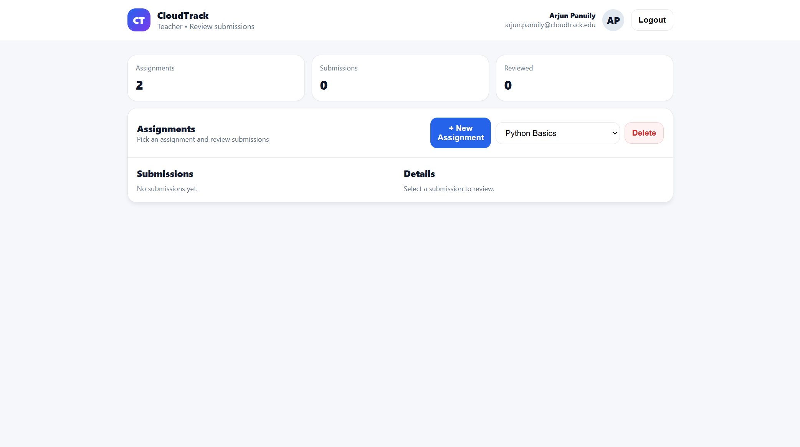
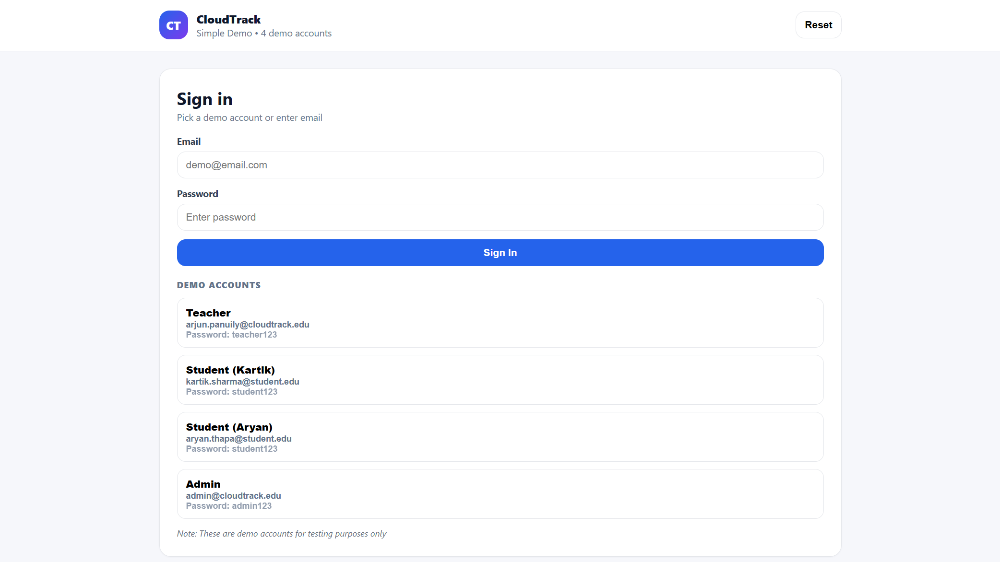
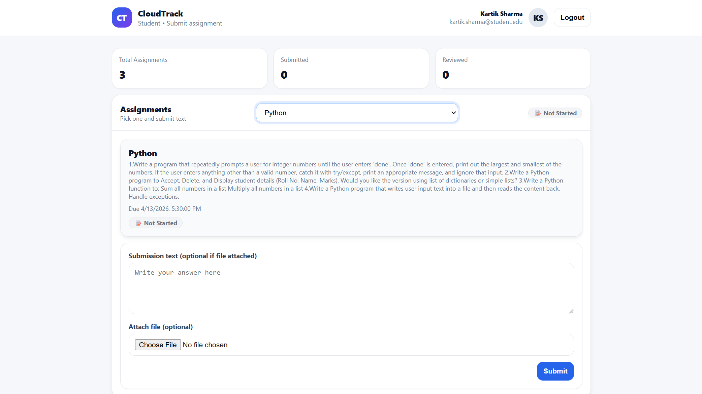
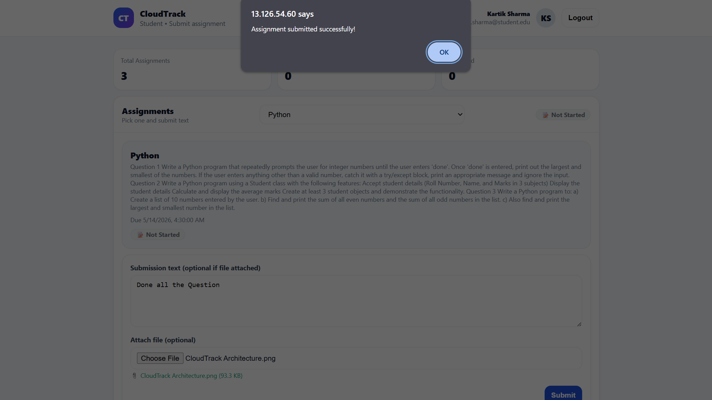
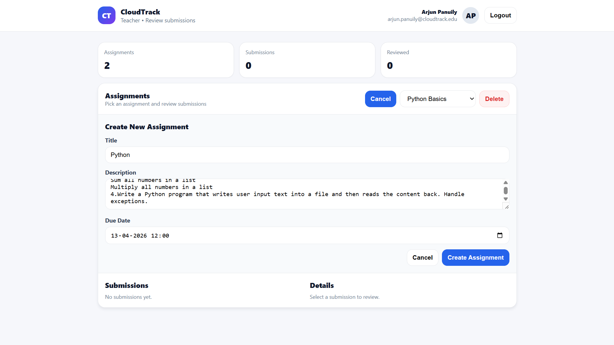
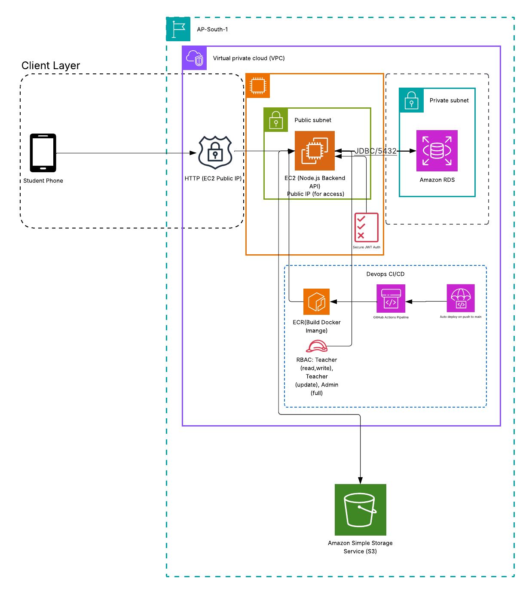

# CloudTrack - My Assignment Management App

So I built this web app for managing school assignments. It lets teachers create assignments, students submit work, and admins see everything.



## How to run it

### What you need first
- Node.js (16+ should work)
- PostgreSQL 
- npm

### Setup steps

```bash
# Install all the dependencies
npm run install:all

# Set up the database
cd backend
cp .env.example .env
# Put your database info in the .env file
npm run db:setup

# Start the app
npm run dev
```

Go to http://localhost:5174 for the frontend and http://localhost:3001 for the backend.

### Login accounts

| Role | Email | Password |
|------|-------|----------|
| Teacher | arjun.panuily@cloudtrack.edu | teacher123 |
| Student | kartik.sharma@student.edu | student123 |
| Student | aryan.thapa@student.edu | student123 |
| Admin | admin@cloudtrack.edu | admin123 |

## What it does

### For students
- See all their assignments
- Submit homework (can write text or attach files)
- Check if teacher reviewed their work
- See grades and feedback

### For teachers
- Create new assignments
- Set due dates and descriptions
- Review what students submitted
- Download files if students attached any
- Give grades and feedback

### For admins
- See overview of everything
- Check system stats

## Technical stuff

- **Frontend**: React with Vite (Vite is pretty fast)
- **Backend**: Node.js + Express + PostgreSQL
- **Database**: PostgreSQL with proper tables
- **Files**: Secure upload system

## Folder structure

```
simple-demo/
├── backend/          # Server code
│   ├── server.js     # Main server file
│   ├── db.js         # Database connection
│   └── uploads/      # Where files get stored
└── frontend/         # React app
    └── src/
        ├── pages/     # React pages
        └── api.js     # API calls
```

## Database setup

Create a `.env` file in the `backend` folder:

```env
DB_HOST=localhost
DB_PORT=5432
DB_NAME=simple_demo
DB_USER=postgres
DB_PASSWORD=your_password
```

## More documentation

Check out [DOCUMENTATION.md](./DOCUMENTATION.md) if you want detailed technical info.

## Main features

- **Login**: Password-based with proper hashing
- **File uploads**: Students can submit files (10MB limit)
- **Status tracking**: See if assignments are submitted/reviewed/overdue
- **Different roles**: Separate pages for teachers, students, and admins
- **Real database**: PostgreSQL so data doesn't disappear

## Screenshots

### Login Page



### Student Dashboard



### Submit Assignment



### Teacher Dashboard



### Cloud Architecture



---